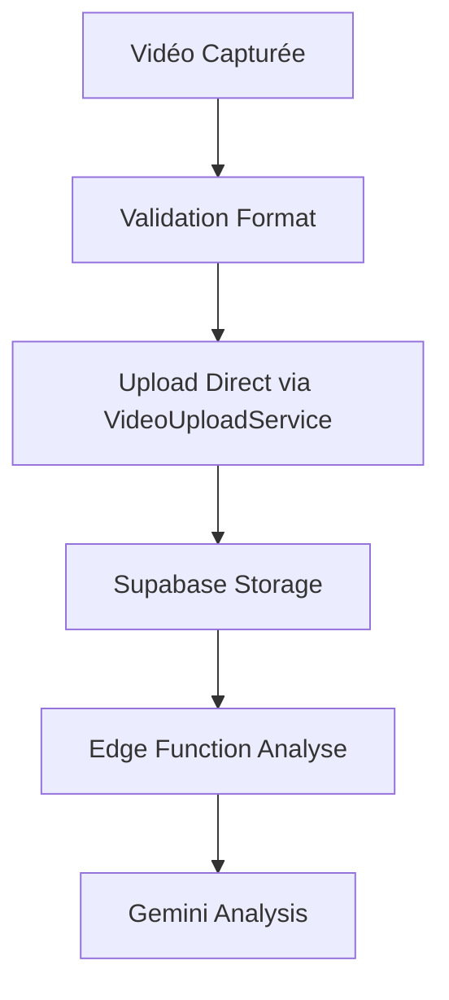

# Upload Vidéo Simplifié - Suppression du Chunking

## 🎯 Objectif

Simplifier le processus d'upload vidéo en supprimant la complexité du chunking, maintenant que les capacités du bucket Supabase ont été étendues.

## 🔄 Changements Effectués

### 1. Suppression du Service de Chunking

**Fichier supprimé :**
- `src/lib/video/video-upload-chunked.ts`

**Raison :** Plus nécessaire avec les capacités étendues du bucket.

### 2. Simplification du Smart Video Processor

**Avant :**
```typescript
// Logique complexe avec seuils de taille
if (originalSize <= this.SIZE_THRESHOLD) {
  // Upload direct
} else {
  // Upload chunked
}
```

**Après :**
```typescript
// Upload direct simplifié
const result = await VideoUploadService.uploadVideo(videoUri, metadata);
```

### 3. Mise à Jour des Limites de Taille

**Variables d'environnement :**
```env
# Avant
EXPO_PUBLIC_MAX_VIDEO_SIZE_MB=10

# Après  
EXPO_PUBLIC_MAX_VIDEO_SIZE_MB=500
```

**Configuration :**
```typescript
// config.ts
maxSizeMB: parseInt(process.env.EXPO_PUBLIC_MAX_VIDEO_SIZE_MB || '500')
```

## 📋 Nouveau Workflow



## ✅ Avantages

1. **Simplicité** : Code plus maintenable
2. **Performance** : Upload direct plus rapide
3. **Fiabilité** : Moins de points de défaillance
4. **Capacité** : Support de fichiers plus volumineux
5. **Maintenance** : Moins de code à maintenir

## 🧪 Tests Recommandés

### Test 1 : Vidéo Petite (5MB)
```bash
# Devrait fonctionner parfaitement
# Upload rapide, analyse complète
```

### Test 2 : Vidéo Moyenne (25MB)
```bash
# Devrait fonctionner sans problème
# Upload un peu plus long mais stable
```

### Test 3 : Vidéo Grande (100MB)
```bash
# Test des nouvelles capacités
# Vérifier stabilité réseau
```

## 🔍 Points de Vérification

- [ ] Upload fonctionne pour différentes tailles
- [ ] Edge function reçoit bien les vidéos
- [ ] Gemini peut traiter les gros fichiers
- [ ] Pas de régression sur les petites vidéos
- [ ] Messages d'erreur appropriés si échec

## 📊 Métriques Attendues

| Métrique | Avant | Après |
|----------|-------|-------|
| Complexité Code | Élevée | Faible |
| Taille Max | 25MB | 500MB |
| Points d'Échec | Multiple | Unique |
| Temps Upload | Variable | Linéaire |

## 🚀 Déploiement

1. **Test local** avec différentes tailles
2. **Validation** du workflow complet
3. **Monitoring** des premiers uploads
4. **Nettoyage** des anciens scripts de test

## 📝 Notes

- Les capacités du bucket Supabase ont été étendues
- Le chunking était une solution de contournement
- L'upload direct est plus simple et efficace
- Garder un œil sur les performances réseau