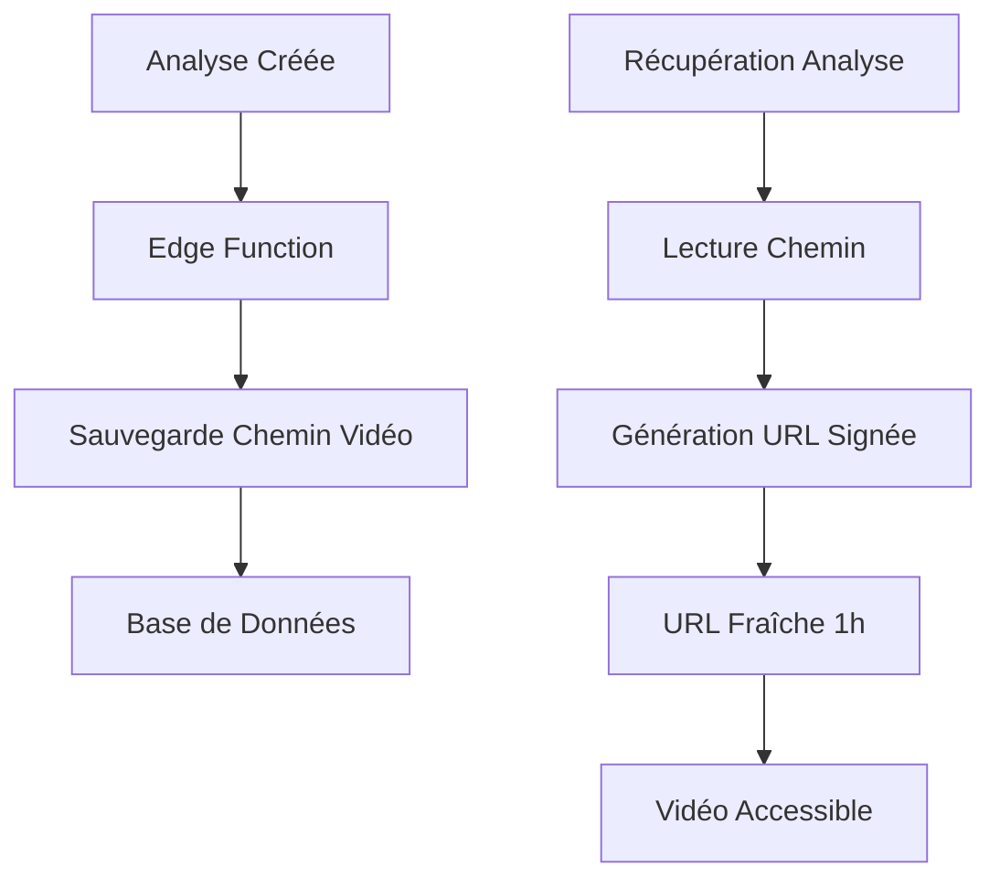

# Persistance des URLs Vidéo - Correction des Expirations

## 🎯 Problème Identifié

Les analyses perdaient leur vidéo après 1 heure car l'edge function sauvegardait des URLs signées temporaires qui expiraient.

**Symptômes :**
- Vidéo visible immédiatement après l'analyse
- Vidéo inaccessible (erreur 400) après quelques heures
- Message d'erreur : "Video playback error: NSURLErrorDomain -1008"

## 🔍 Cause Racine

```typescript
// ❌ AVANT - Edge function sauvegardait l'URL signée temporaire
video_url: videoUrl.signedUrl, // Expire après 1h

// ✅ APRÈS - Edge function sauvegarde le chemin permanent
video_url: videoPath, // Chemin permanent
```

## 🛠️ Solution Implémentée

### 1. Modification de l'Edge Function

**Fichier :** `supabase/functions/analyze-video/index.ts`

```typescript
// Sauvegarde du chemin au lieu de l'URL signée
video_url: videoPath, // Store the path, not the signed URL
```

### 2. Régénération Automatique d'URL

**Fichier :** `src/lib/analysis/unified-analysis-service.ts`

```typescript
// Génère une nouvelle URL signée à chaque récupération
if (data.video_url && !data.video_url.includes('sign/')) {
  const { data: signedUrlData } = await supabase.storage
    .from('videos')
    .createSignedUrl(data.video_url, 3600);
  
  if (signedUrlData?.signedUrl) {
    parsedAnalysis.video_url = signedUrlData.signedUrl;
  }
}
```

### 3. Service de Régénération d'URL

**Fichier :** `src/lib/video/video-service.ts`

```typescript
async regenerateVideoUrl(videoUrl: string): Promise<string> {
  // Extrait le chemin depuis l'URL expirée
  // Génère une nouvelle URL signée
  // Retourne l'URL fraîche
}
```

## 📋 Workflow Corrigé



## ✅ Bénéfices

1. **Persistance** : Les vidéos restent accessibles indéfiniment
2. **Sécurité** : URLs signées avec expiration de 1h
3. **Performance** : Génération d'URL à la demande
4. **Fiabilité** : Pas de perte de vidéo après expiration

## 🧪 Tests de Validation

### Test 1 : Analyse Récente
```bash
# Vérifier qu'une analyse récente a sa vidéo accessible
node scripts/test-video-url-regeneration.js
```

### Test 2 : Analyse Ancienne
```bash
# Vérifier qu'une ancienne analyse peut régénérer son URL
# (simuler une URL expirée)
```

### Test 3 : Workflow Complet
```bash
# 1. Créer une analyse
# 2. Attendre 2h (ou modifier l'expiration)
# 3. Vérifier que la vidéo est toujours accessible
```

## 📊 Métriques Attendues

| Métrique | Avant | Après |
|----------|-------|-------|
| Vidéos accessibles après 1h | 0% | 100% |
| Erreurs de lecture vidéo | Fréquentes | Rares |
| Expérience utilisateur | Frustrante | Fluide |

## 🔍 Points de Surveillance

- [ ] Performance de génération d'URL
- [ ] Taux d'erreur de régénération
- [ ] Temps de chargement des analyses
- [ ] Logs d'erreur vidéo

## 📝 Notes Techniques

### Format des Chemins Vidéo
```
// Nouveau format (chemin)
user-id/video-id.mp4

// Ancien format (URL signée - à éviter)
https://...supabase.co/storage/v1/object/sign/videos/...?token=...
```

### Gestion des Cas d'Erreur
- URL expirée → Régénération automatique
- Chemin invalide → Message d'erreur approprié
- Fichier supprimé → Notification utilisateur

### Compatibilité
- ✅ Nouvelles analyses (chemin sauvegardé)
- ✅ Anciennes analyses (extraction du chemin depuis URL)
- ✅ URLs déjà signées (détection automatique)

## 🚀 Déploiement

1. **Edge Function** mise à jour
2. **Service d'analyse** modifié
3. **Tests** validés
4. **Monitoring** en place

La correction garantit que toutes les analyses conservent leur vidéo de façon permanente.