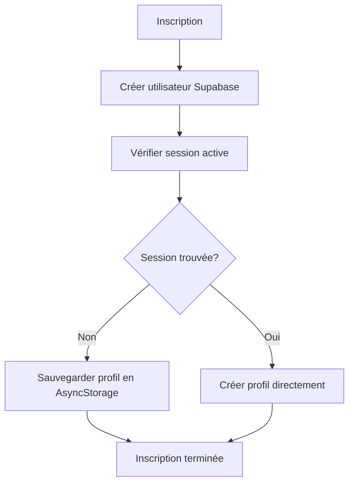
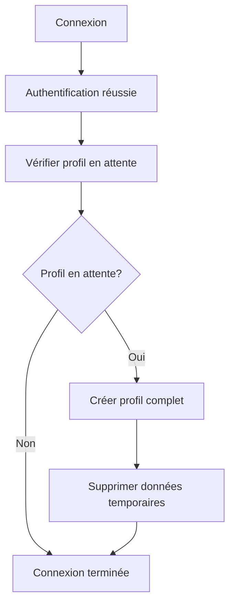

# Test Final - Inscription avec Profil Complet

## Problème résolu

Le problème était les **politiques RLS (Row Level Security)** qui empêchaient la création de profil lors de l'inscription car l'utilisateur n'était pas encore authentifié.

## Solution implémentée

### Système de profils en attente
1. **Inscription** → Données sauvegardées localement
2. **Première connexion** → Profil créé avec les données sauvegardées
3. **Nettoyage** → Données temporaires supprimées

## Comment tester

### 1. Test d'inscription
1. Ouvrir l'app mobile
2. Aller sur "S'inscrire"
3. Remplir le formulaire complet :
   - Prénom : "Test"
   - Nom : "User"
   - Ville : "Paris"
   - Email : "test@example.com"
   - Mot de passe : "password123"
   - Index : 15.5 (optionnel)
   - Main dominante : Droitier (optionnel)
4. Cliquer sur "Créer mon compte"

### 2. Vérifier les logs d'inscription
```
🚀 Starting signup process...
✅ User created successfully: [user-id]
⏳ Waiting for user session...
⚠️ No active session, saving profile for later completion
💾 Profile data saved for completion on first login
```

### 3. Confirmer l'email
1. Vérifier l'email de confirmation
2. Cliquer sur le lien de confirmation

### 4. Test de première connexion
1. Retourner à l'app
2. Se connecter avec les mêmes identifiants
3. Vérifier les logs de connexion :
```
✅ User signed in successfully
🔄 Checking for pending profile for user: [user-id]
📝 Found pending profile, attempting to create...
✅ Pending profile completed successfully
🗑️ Pending profile cleared for user: [user-id]
```

### 5. Vérifier le profil
1. Aller dans l'écran de profil
2. Vérifier que toutes les informations sont présentes :
   - ✅ Prénom : "Test"
   - ✅ Nom : "User"
   - ✅ Ville : "Paris"
   - ✅ Email : "test@example.com"
   - ✅ Index : 15.5
   - ✅ Main dominante : Droitier

## Diagnostic en cas de problème

### Utiliser le bouton de test (mode dev)
1. Sur l'écran d'inscription, cliquer sur "Test Base de Données"
2. Vérifier les résultats :
   - Table exists: ✅
   - SELECT permission: ✅
   - INSERT permission: ❌ (normal, à cause de RLS)

### Vérifier les données en attente
Dans la console, vous pouvez vérifier :
```javascript
// Lister les profils en attente
await PendingProfileService.listPendingProfiles();

// Vérifier un profil spécifique
await PendingProfileService.getPendingProfile('user-id');
```

## Workflow technique

### Inscription (sans session)


### Première connexion


## Points importants

1. **RLS est normal** - Les politiques de sécurité empêchent l'insertion lors de l'inscription
2. **Profil créé à la connexion** - C'est le comportement attendu
3. **Données temporaires** - Sauvegardées localement et nettoyées après usage
4. **Fallback robuste** - Plusieurs stratégies pour assurer la création du profil

## Résultat attendu

Après inscription et première connexion, l'utilisateur doit avoir un profil complet avec toutes les informations saisies lors de l'inscription.

## Nettoyage (si nécessaire)

Pour nettoyer les profils en attente :
```javascript
await PendingProfileService.clearAllPendingProfiles();
```